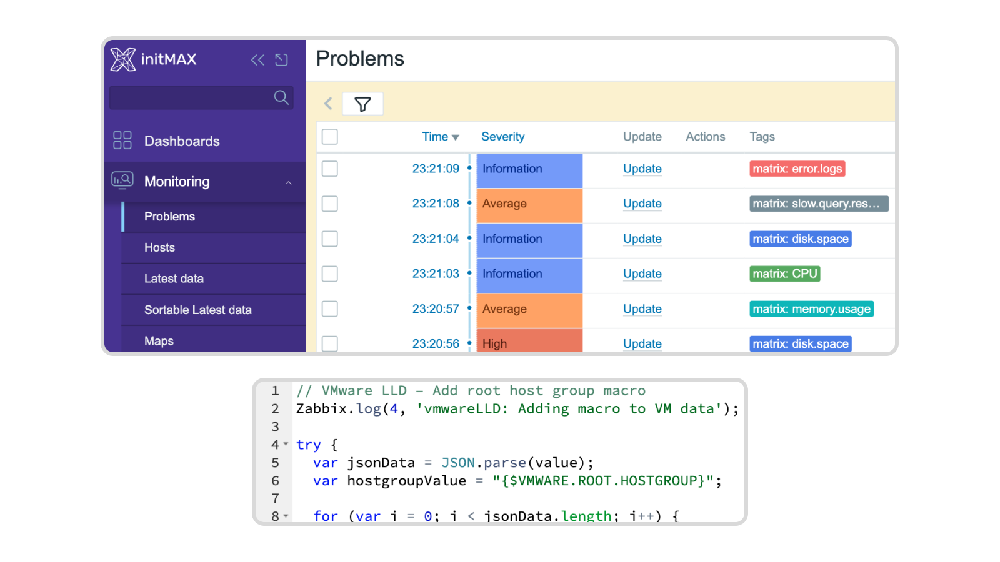

<div align="center">
    <a href="http://www.initmax.com"></a>
    <h3>
        <span>
            Honesty, diligence and MAXimum knowledge of our products is our standard.
        </span>
    </h3>
    <h3>
        <a href="https://www.linkedin.com/company/initmax/">
            
        </a>&nbsp;&nbsp;&nbsp;
        <a href="https://www.youtube.com/@initmax1">
            
        </a>&nbsp;&nbsp;&nbsp;
        <a href="https://www.facebook.com/initmax">
            
        </a>&nbsp;&nbsp;&nbsp;
        <a href="https://www.instagram.com/initmax/">
            
        </a>&nbsp;&nbsp;&nbsp;
        <a href="https://x.com/initmax">
            
        </a>&nbsp;&nbsp;&nbsp;
        <a href="https://github.com/initmax">
            
        </a>
    </h3>
</div>
<br>

---
---

<br>
<br>
<!-- *********************************************************************************************************************************** -->
<!-- *** TITLE ************************************************************************************************************************* -->
<!-- *********************************************************************************************************************************** -->
<div align="center">
    <h1>
        uxMAX
    </h1>
    <h4><i>
        Advanced UI configuration for Zabbix — color tags, dashboard tweaks, draggable modals, custom themes and fonts, syntax highlighting in editors, and per-user overrides.
    </i></h4>
    <br>
    
    
    <h3>
        <a href="#description">Description</a> &nbsp;•&nbsp;
        <a href="#key-features">Key Features</a> &nbsp;•&nbsp;
        <a href="#documentation">Documentation</a> &nbsp;•&nbsp;
        <a href="#installation">Installation</a>
    </h3>
    <br>
    
</div>
<br>
<br>

<!-- *********************************************************************************************************************************** -->
<!-- *** BODY ************************************************************************************************************************** -->
<!-- *********************************************************************************************************************************** -->
<a id="description"></a>
## Description

The uxMAX module enhances Zabbix by providing advanced UI configuration options
that improve clarity and overall user experience. Tailor colour themes and
fonts, tidy up dashboards, make modal dialogs draggable, color-code tags for
faster recognition, get syntax highlighting in editors, and let each user
layer their own preferences on top — all from a single Zabbix module.

<br>

<a id="key-features"></a>
## Key Features

### Dashboards
- **Hide widget header outside edit mode** — for widgets with *Show header* unchecked, the header is hidden completely (not even on hover) and reappears only when the dashboard is switched to edit mode.
- **Compact dashboard** — removes the padding around widgets so they sit flush against each other; saves space on dense dashboards.

### Color tags
- **Colored tags** — tags throughout the UI are coloured according to your rules (starts with / contains / ends with), making them easier to scan at a glance.
- **Per-user overrides** — each user can layer their own color tag rules on top of the global ones from *My uxMAX*; admins can disable this gate globally.

### UI behavior
- **Draggable modal windows** — drag modal dialogs by their title bar. Intended mainly for Zabbix 7.0 (Zabbix 7.4 has this natively).
- **Minimum modal width** — set a pixel minimum for modal dialogs when the default is too narrow for the content.
- **Show disabled items in Latest data** — disabled items appear greyed out with a *D* badge in the Info column.

### Appearance
- **Custom color theme** — custom background color for the page body and/or the sidebar; useful for distinguishing multiple Zabbix instances at a glance.
- **Custom font** — load a font from a Google Fonts URL or upload a font file; applied across the whole Zabbix UI.

### Syntax highlighting
- **JavaScript** (script items, preprocessing) and **Zabbix expressions** (triggers, calculated items) in editors, with adjustable font size and family.

### Compatibility
- Fully compatible with **Zabbix 7.0** and **PHP 8.0**.

<br>

<a id="documentation"></a>
## Documentation

<div align="center">
    <a href="https://www.initmax.com/wiki/uxmax/">
        <br>
        <b>Full documentation on the initMAX wiki</b><br>
        
    </a>
</div>

<br>

<!-- *********************************************************************************************************************************** -->
<!-- *** INSTALLATION ******************************************************************************************************************* -->
<!-- *********************************************************************************************************************************** -->
<a id="installation"></a>
## Installation

- Connect to your Zabbix frontend server (perform on all frontend nodes) via SSH.

- Navigate to the `ui/modules/` directory (`ui` is typically located at `/usr/share/zabbix/ui/`)
    ```sh
    cd /usr/share/zabbix/ui/modules/
    ```

- Clone the repository on your server
    ```sh
    git clone https://git.initmax.cz/initMAX-Public/zabbix/modules/Zabbix-UI-Modules-uxMAX.git
    ```

- Change ownership of the directory to the user under which your Zabbix frontend runs:
    ```sh
    chown nginx:nginx ./Zabbix-UI-Modules-uxMAX*
    ```
    ```sh
    chown apache:apache ./Zabbix-UI-Modules-uxMAX*
    ```
    ```sh
    chown www-data:www-data ./Zabbix-UI-Modules-uxMAX*
    ```

- Open the Zabbix frontend menu → Administration → General → Modules
- Click **Scan directory** at the top
- Enable the newly discovered uxMAX module
- Configure all options under **Administration → uxMAX configuration**; users can manage their per-user color tag overrides under **User settings → My uxMAX**.

<br>
<br>

---
---

<br>
<div align="center">
    <a href="https://www.initmax.com/">
         initMAX.com
    </a>&nbsp;&nbsp;&nbsp;
    <a href="tel:+420800244442">
         +420800244442
    </a>&nbsp;&nbsp;&nbsp;
    <a href="mailto:info@initmax.com">
         info@initmax.com
    </a>
    <br><br><br>
    <a href="https://www.linkedin.com/company/initmax/">
        
    </a>&nbsp;
    <a href="https://www.youtube.com/@initmax1">
        
    </a>&nbsp;
    <a href="https://www.facebook.com/initmax">
        
    </a>&nbsp;
    <a href="https://www.instagram.com/initmax/">
        
    </a>&nbsp;
    <a href="https://x.com/initmax">
        
    </a>&nbsp;
    <a href="https://github.com/initmax">
        
    </a><br><br><br>
    <a></a>&nbsp;&nbsp;&nbsp;
    <a></a>
    <br><br><br>
    <a>
        
    </a>
</div>